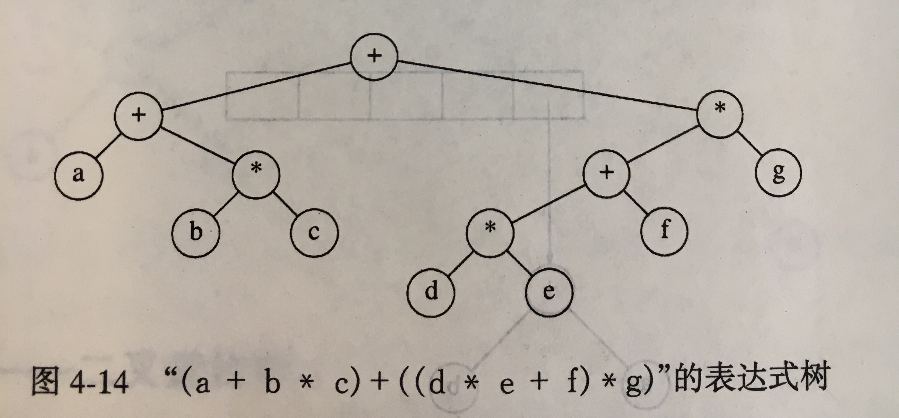
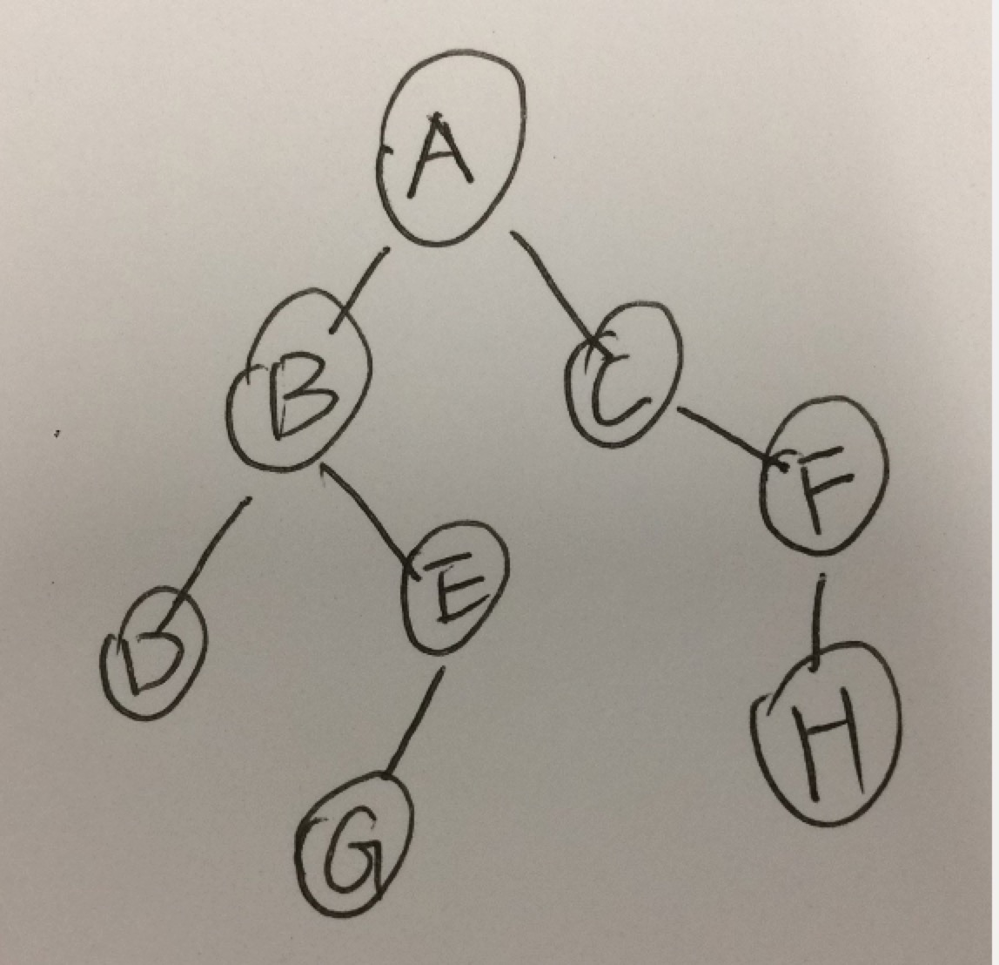

### 递归(Recursive)
当一个函数用它自己来定义时就称为时递归。
阶乘、斐波那契数列和汉诺塔，帕斯卡三角形，也就是著名的杨辉三角
```c // 递归
void recursion_loop(int i) {
    if (i == 10)
        return;
    else
        recursion_loop(i + 1);
}
// 调用： recursion_loop(0);
```

### 取幂运算
计算x的N次方常见的算法是N-1次乘法自乘，递归的基准条件是：N==0  此时返回1（不调用自身）。
若N是偶数，则x的N次方等于 x*x的N/2次方。
若N是奇数，则x的N次方等于 x*x的N/2次方在乘以x。
时间复杂度：O($\log_2 n$)
```c // 取幂运算
long int pow(long int x, unsigned int n) {
    if (n == 0)
        return 1;
    if (n == 1)
        return x;
    if ((x & 1) == 0) { // 偶数
        return pow(x * x, n / 2);
    } else {
//        return pow(x * x, n / 2) * x;
        return pow(x, n - 1) * x;
    }
}
```

### 阶乘
0!=1，n!=(n-1)!×n
```c // 阶乘
static long factorial(const long n) {
    return 0 == n || 1 == n ? 1  : n * factorial(n - 1);
}
```

### 斐波那契数列(Fibonacci)
又称黄金分割数列,以递归的方法定义：F(0)=0，F(1)=1, F(n)=F(n-1)+F(n-2)（n>=2，n∈N*）
1, 1, 2, 3, 5, 8, 13, 21, 34...这个数列从第3项开始，每一项都等于前两项之和。
```c // Fibonacci
static long fib(const long n) {
    return 0 == n || 1 == n ? 1 : fib(n - 1) + fib(n - 2);
}
```

### 汉诺塔
假设有n片，移动次数是f(n).显然f(1)=1,f(2)=3,f(3)=7，且f(k+1)=2*f(k)+1 (等比数列)。
证明(数学归纳法) f(n)=$2^n$-1。
a(n) = 2*a(n-1) + 1;
a(n) + 1 = 2*(a(n-1) + 1);
于是{a(n)+1}是首项为a(1)=1，公比为2的等比数列，
求得a(n)+1 = $2^n$，所以a(n) = $2^n$ - 1;
```c // Fibonacci
static void move(const char x, const int n, const char z) {
    printf("把圆盘 %d 从柱子 %c 移动到 %c 上\n", n, x, z);
}
static void hanoi(const int n, const char x, const char y, const char z) {
    if (1 == n)
        move(x, 1, z);          // 如果只有一个盘，则直接将它从x移动到z
    else {
        hanoi(n - 1, x, z, y);  // 把1 ~ n - 1个盘从x移动到y，用z作为中转
        move(x, n, z);           // 把第n个盘从x移动到z
        hanoi(n - 1, y, x, z);  // 把1 ~ n - 1个盘从y移动到z，用x作为中转
    }
}
```

### 帕斯卡三角形
也就是著名的杨辉三角:三角形边界上的数都是1，内部的每个数是位于它上面的两个数之和。
```
    1
    1    1
    1    2    1
    1    3    3    1
    1    4    6    4    1
```
利用递归我们可以很容易地把问题转换为这个性质：
假设：f(row, col)表示杨辉三角的第row行的第col个元素，那么：
1. f(row, col) = 1 (col = 1 或者 row = col)，也就是递归的停止条件。
2. f(row, col) = f(row - 1, col - 1) + f(row - 1, col)，也就是上一行的两个相邻元素的和。

```c // 帕斯卡三角形
static long GetElement(const long row, const long col) {
    if ((1 == col) || (row == col)) // 每行的外围两个元素为1
        return 1;
    else // 其余的部分为上一行的(col - 1)和(col)元素之和
        return GetElement(row - 1, col - 1) + GetElement(row - 1, col);
}
```

### 求两个整数的最大公约数
最大公约数:几个整数中公有的约数，叫做这几个数的公约数；其中最大的一个，叫做这几个数的最大公约数。
最小公倍数:公倍数(common multiple)指在两个或两个以上的自然数中，如果它们有相同的倍数，这些倍数就是它们的公倍数，其中除0以外最小的一个公倍数，叫做这几个数的最小公倍数。
两个数的乘积等于两个数的最大公约数和最小公倍数的乘积。

最大公约数：同时整除两个整数的最大整数。
最小公倍数 = (a * b)/最大公约数。

如果N整除A-B，那么我们就说A与B模N同余。

```c // 最大公约数
// 1.直接遍历法
int maxCommonDivisor(int a, int b) {
    int max = 0;
    for (int i = 1; i <=b; i++) {
        if (a % i == 0 && b % i == 0) {
            max = i;
        }
    }
    return max;
}

// 2.辗转相除法
int maxCommonDivisor(int a, int b) {
    int r;
    while(a % b > 0) {
        r = a % b;
        a = b;
        b = r;
    }
    return b;
}

// 3.欧几里得算法计算最大公约数
int gcd(int m, int n) {
    int rem;
    while (n > 0) {
        rem = m % n;
        m = n;
        n = rem;
    }
    return m;
}
```

### 不用中间变量,用两种方法交换A和B的值
```c // 交换
// 1.中间变量
void swap(int a, int b) {
   int temp = a;
   a = b;
   b = temp;
}

// 2.加法
void swap(int a, int b) {
   a = a + b;
   b = a - b;
   a = a - b;
}

// 3.异或（相同为0，不同为1. 可以理解为不进位加法）
void swap(int a, int b) {
   a = a ^ b;
   b = a ^ b;
   a = a ^ b;
}
```

### 实现一个字符串“how are you”的逆序输出
如给定字符串为“hello world”,输出结果应当为“world hello”。
```c // 逆序
 int spliterFunc(char *p) {
    char c[100][100];
    int i = 0;
    int j = 0;
    while (*p != '\0') {
        if (*p == ' ') {
            i++;
            j = 0;
        } else {
            c[i][j] = *p;
            j++;
        }
        p++;
    }

    for (int k = i; k >= 0; k--) {
        printf("%s", c[k]);
        if (k > 0) {
            printf(" ");
        } else {
            printf("\n");
        }
    }
    return 0;
}
```

### 给定一个字符串，输出本字符串中只出现一次并且最靠前的那个字符的位置
如“abaccddeeef”,字符是b,输出应该是2。
```c // 输出字符串
 char *strOutPut(char *);
int compareDifferentChar(char, char *);

int main(int argc, const char * argv[]) {
    char *inputStr = "abaccddeeef";
    char *outputStr = strOutPut(inputStr);
    printf("%c \n", *outputStr);
    return 0;
}

char *strOutPut(char *s) {
    char str[100];
    char *p = s;
    int index = 0;
    while (*s != '\0') {
        if (compareDifferentChar(*s, p) == 1) {
            str[index] = *s;
            index++;
        }
        s++;
    }
    return &str;
}

int compareDifferentChar(char c, char *s) {
    int i = 0;
    while (*s != '\0' && i<= 1) {
        if (*s == c) {
            i++;
        }
        s++;
    }
    if (i == 1) {
        return 1;
    } else {
        return 0;
    }
}
```

### 二叉树遍历
二叉树的先序遍历为FBACDEGH,中序遍历为：ABDCEFGH,请写出这个二叉树的后序遍历结果。
ADECBHGF



先序遍历：++a*bc*+*defg :
根----->左——>右 :先访问根节点，前序遍历左子树，再前序遍历右子树。（简记为：VLR）

中序遍历：(a+b*c)+((d*e+f)*g) :
左----->根----->右 :从根节点开始，中序遍历根节点的左子树，然后访问根节点，最后中序遍历右子树。（简记为：LVR）

后序遍历：abc*+de*f+g*+ :
左----->右----->根 :从左到右先叶子后节点的方式遍历访问左右子树，左右子树都访问结束，才访问根节点。（简称LRV）

层序遍历：++*a*+gbc*fde :
左--->右  上--->下


先序+中序遍历还原二叉树：先序遍历是：ABDEGCFH 中序遍历是：DBGEACHF
首先从先序得到第一个为A，就是二叉树的根，回到中序，可以将其分为三部分：
左子树的中序序列DBGE，根A，右子树的中序序列CHF
接着将左子树的序列回到先序可以得到B为根，这样回到左子树的中序再次将左子树分割为三部分：
左子树的左子树D，左子树的根B，左子树的右子树GE
同样地，可以得到右子树的根为C
类似地将右子树分割为根C，右子树的右子树HF，注意其左子树为空 
如果只有一个就是叶子不用再进行了，刚才的GE和HF再次这样运作，就可以将二叉树还原了。
后序遍历：DGEBHFCA

### 打印2-100之间的素数(质数)
质数又称素数。一个大于1的自然数，除了1和它自身外，不能整除其他自然数的数叫做质数；否则称为合数。
在一般领域，对正整数n，如果用 2 到 $\sqrt n$ 之间的所有整数去除，均无法整除，则n为质数。
```c // 素数
 int main(int argc, const char * argv[]) {
    for (int i = 2; i < 100; i++) {
        int r = isPrime(i);
        if (r == 1) {
            printf("%ld ", i);
        }
    }
    return 0;
}

int isPrime(int n) {
    int i, s;
    for(i = 2; i <= sqrt(n); i++)
        if(n % i == 0)  return 0;
    return 1;
}
```

### 给一列无序数组，求出中位数并给出算法的时间复杂度。
若数组有奇数个元素，中位数是a[(n-1)/2]；
若数组有偶数个元素，中位数为a[n/2-1]和a[n/2]两个数的平均值。
这里为方便起见，假设数组为奇数个元素。

**思路一：**把无序数组排好序，取出中间的元素。
时间复杂度取决于排序算法，最快是快速排序，O(n$\log_2 n$)，或者是非比较的基数排序，时间为O(n),空间为O(n)。这明显不是我们想要的。

**思路二：**采用快速排序的分治partition过程。
任意挑一个元素，以该元素为支点，将数组分成两部分，左边是小于等于支点的，右边是大于支点的。
如果左侧长度正好是(n - 1)/2，那么支点恰为中位数。
如果左侧长度<(n-1)/2, 那么中位数在右侧，反之，中位数在左侧，进入相应的一侧继续寻找中位数。

```c // 快速排序的分治过程找无序数组的中位数  
int partition(int a[], int low, int high)  { // 快排的一次排序过程
    int q = a[low];
    while (low < high) {
        while (low < high && a[high] >= q)
            high--;
        a[low] = a[high];
        while (low < high && a[low] <= q)
            low++;
        a[high] = a[low];
    }
    a[low] = q;
    return low;
}

int findMidium(int a[], int n) {
    int index = n / 2;
    int left = 0;
    int right = n - 1;
    int q = -1;
    while (index != q) {
        q = partition(a, left, right);
        if (q < index)
            left = q + 1;
        else if (q>index)
            right = q - 1;
    }
    return a[index];
}
```

**思路三：**将数组的前(n+1)/2个元素建立一个最小堆。
然后，对于下一个元素，和堆顶的元素比较，如果小于等于，丢弃之，如果大于，则用该元素取代堆顶，再调整堆，接着看下一个元素。
重复这个步骤，直到数组为空。当数组都遍历完了，(堆中元素为最大的(n+1)/2个元素) 堆顶的元素即是中位数。

```c // 构建最小堆找无序数组的中位数  
void nswap(int& i, int& j) {
    i = i^j;
    j = i^j;
    i = i^j;
}

void minHeapify(int a[], int i, int len) {
    int least = i; // 根节点,最小的
    int l = i * 2 + 1;
    int r = i * 2 + 2;
    if (l < len && a[l] < a[least])
        least = l;
    if (r < len && a[r] < a[least])
        least = r;
    if (least != i) {
        nswap(a[i], a[least]);
        minHeapify(a, least, len);
    }
}
void buildMinHeap(int a[], int len) {
    // len/2-1 或者 (len-2) / 2, 为最后一个非叶子节点
    for (int i = (len-2) / 2; i >= 0; i--) {
        minHeapify(a, i, len);
    }
}

int findMidium2(int a[], int n) {
    buildMinHeap(a, (n + 1) / 2);
    for (int i = (n + 1) / 2; i < n; i++) {
        if (a[i] > a[0]) {
            nswap(a[i], a[0]);
            minHeapify(a, 0,(n + 1) / 2);
        }
    }
    return a[0];
}
```

**引申一：查找N个元素中的第K个小的元素**
编程珠玑给出了一个时间复杂度O(N)的解决方案。该方案改编自快速排序。
经过快排的一次划分，
   1）如果左半部份的长度>K-1，那么这个元素就肯定在左半部份了
   2）如果左半部份的长度==K-1，那么当前划分元素就是结果了。
   3）如果。。。。。。。<K-1,那么这个元素就肯定在右半部分了。
并且，该方法可以用尾递归实现。效率更高。
也可以用来查找N个元素中的前K个小的元素，前K个大的元素。。。。等等。

**引申二：查找N个元素中的第K个小的元素，假设内存受限，仅能容下K/4个元素。**
分趟查找，
第一趟，用堆方法查找最小的K/4个小的元素，同时记录剩下的N-K/4个元素到外部文件。
第二趟，用堆方法从第一趟筛选出的N-K/4个元素中查找K/4个小的元素，同时记录剩下的N-K/2个元素到外部文件。
。。。
第四趟，用堆方法从第一趟筛选出的N-K/3个元素中查找K/4个小的元素，这是的第K/4小的元素即使所求。

### 输入一个整型数组，求出子数组和的最大值，并给出算法的时间复杂度。
假如只有两个数，a[0] and a[1]。
这样，最大值存在的情况，无非就是：a[0], a[0] + a[1], a[1]。这个过程基本就是三个数字中，找到最大值的过程。

然后推广到n的时候，从0->n - 1遍历只要重复这个过程，就能简单的获取到最终的最大值。

假设现在有三个数字a[0] a[1] a[2].
这样先比较前两个元素，a[0],a[1],以及a[0] + a[1]。因为下次的比较需要将前面的a[0]+a[1]作为一个整体加入到下一次的比较中，所以需要有一个值能够用来表示其和。这个变量用nStart表示。
nAll则是相当于每次比较中的a[0]。那么每次的比较的顺序就是：a[1]和a[0] + a[1]比较。nStart取其最大值，然后在和相当于a[0]的nAll比较。如此往复，当线性遍历结束的时候，就成功的获取到了最大值。

时间复杂度O(n)，空间复杂度为O(1)。
```
#include <iostream>
using namespace std;

#define max(a, b) (a)>(b)?(a):(b)

int MaxSubArray(int *a, int n) {
    int nStart = a[0];
    int nAll = a[0];
    for (int i = 1; i < n; ++i) {
        nStart = max(a[i], nStart + a[i]);
        nAll = max(nStart, nAll);
    }
    return nAll;
}
int main() {
    cout << "Hello world!" << endl;
    int array[] = {10, -1, 3, -11, -20, 33, 1, -6, 13};
    cout << MaxSubArray(array, sizeof(array)/sizeof(int)) << endl;
    return 0;
}
```
