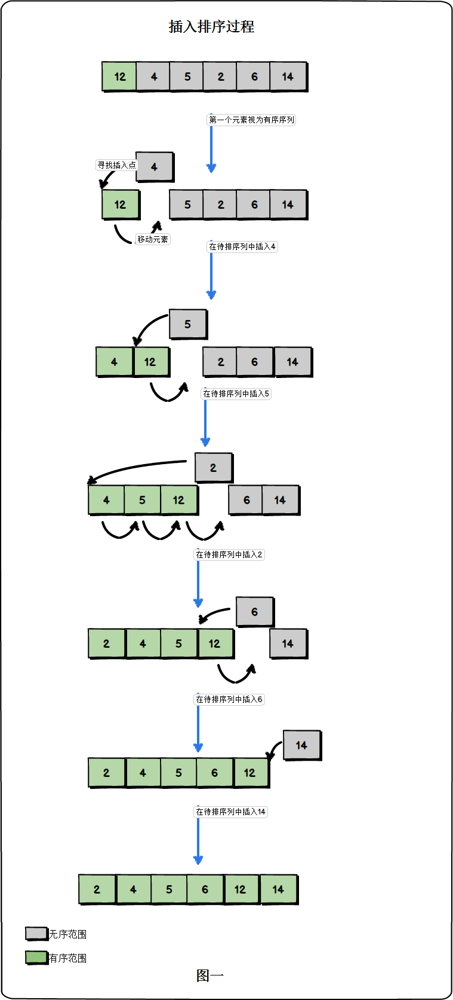

排序分为内部排序和外部排序，内部排序指待排序的记录在内存中，外部排序的记录数量很大，以至于内存放不下而放在外存中，排序过程需要访问外存。这里仅介绍内部排序，包括插入排序、交换排序、选择排序、归并排序、基数排序。

### 插入排序

**1，直接插入排序：**就是检查第i个数字，如果在它的左边的数字比它大，进行交换，这个动作一直继续下去，直到这个数字的左边数字比它还要小，就可以停止了。插入排序法主要的回圈有两个变数：i和j，每一次执行这个回圈，就会将第i个数字放到左边恰当的位置去。
时间复杂度：O($n^2$)

```c // 直接插入 从小到大排序
    void insertSort(int a[], int n) {
        for(int i = 1; i < n; i++) {
            int tmp = a[i];
            int j = i - 1;
            while((a[j] > tmp) && (j >= 0)) {
                a[j+1] = a[j];
                j--;
            }
            a[j+1] = tmp;
        }
    }
```

```c // 直接插入
 void insertSort(int a[], int n) {
        for(int i = 1; i < n; i++) {
            int tmp = a[i];
            int j = i - 1;
            for (; j >= 0 && a[j] > tmp; j--) {
                a[j+1] = a[j];
            }
            a[j+1] = tmp;
        }
    }
```

**2，折半插入排序（binary insertion sort）：**当直接插入进行到某一趟时，对于a[i]来讲，前面i－1个记录已经按关键字有序。此时不用直接插入排序的方法，而改为折半查找，找出a[i]应插入的位置。
时间复杂度：O($n^2$)

```c // 折半插入 从小到大排序
    void binaryInsertSort(int a[], int n) {
        for (int i = 1; i < n; i++) {
            int tmp = a[i];
            int low = 0;
            int high = i - 1;
            while (low <= high) {
                int middle = (low + high) / 2;
                if (tmp < a[middle]) {
                    high = middle - 1;
                } else {
                    low = middle + 1;
                }
            }
            for (int j = i-1; j >= low; j--) {
                a[j+1] = a[j];
            }
            a[low] = tmp;
        }
    }
```

**3，希尔排序：**“缩小增量”的排序方法，初期选用增量较大间隔比较，然后增量缩小，最后为1，希尔排序对增量序列没有严格规定。
时间复杂度：O($n^(1.3)$)

```c // 希尔排序 从小到大排序
    void shellSort(int a[], int n) {
        int k = n / 2;
        while (k > 0) {
            for (int i = k; i < n; i++) {
                int tmp = a[i];
                int j = i - k;
                while ((a[j] > tmp) && (j >= 0)) {
                    a[j+k] = a[j];
                    j -= k;
                }
                a[j+k] = tmp;
            }
            k /= 2;
        }
    }
```

### 交换排序

**1，冒泡排序：**面对一排数据，先从前往后两两比较，如果前一个数比后一个数大就交换两者的顺序，即第一个数和第二个数比，第二个数和第三个数比，……,倒数第二个数和最后一个数比，这样一轮下来以后最大的数就排到最后；接着把除去最大的数的该组数据进行同样的操作，直至这组数只剩下一个，排序结束。
时间复杂度：O($n^2$)

```c // 冒泡排序
    void bubbleSort(int a[] , int n) {
        for(int i = 0; i < n; i++) {
            for(int j = 0; j < n-i-1; j++) { // 比较两个相邻的元素
                if(a[j] > a[j+1]) {
                    int t = a[j];
                    a[j] = a[j+1];
                    a[j+1] = t;
                }
            }
        }
    }
```

**2，快速排序：**选取一个基准元素(通常已需要排序的数组第一个数)，然后通过一趟排序将比基准数大的放在右边，比基准数小的放在左边，接着对划分好的两个数组再进行上述的排序。快速排序的每一轮处理其实就是将这一轮的基准数归位，直到所有的数都归位为止，排序就结束了。
时间复杂度：O(n$\log_2 n$)

挖坑填数进行总结
1)．i = left;   j = right; 将基准数挖出形成第一个坑a[i]。
2)．j- -由后向前找比它小的数，找到后挖出此数填前一个坑a[i]中。
3)．i++由前向后找比它大的数，找到后也挖出此数填到前一个坑a[j]中。
4)．再重复执行2，3二步，直到i==j，将基准数填入a[i]中。

```c // 快速排序
    void qsort(int a[], int left, int right) {
        if(left >= right) { // 如果左边索引大于或者等于右边的索引就代表已经整理完成一个组了
            return ;
        }
        int i = left;
        int j = right;
        int key = a[left];

        while(i < j) { // 控制在当前组内寻找一遍
            while(i < j && key <= a[j]) {
                j--; // 向前寻找
            }
            if (i < j) {
                a[i] = a[j]; // 将比第一个小的移到低端
            }
            
            while(i < j && key >= a[i]) {
                i++; // 向后寻找
            }
            if (i < j) {
                a[j] = a[i]; // 将比第一个大的移到高端
            }
        }
        a[i] = key; // 当在当组内找完一遍以后就把中间数key回归
        
        qsort(a, left, i - 1);
        qsort(a, i + 1, right);
    }
```

### 选择排序

**1，简单选择排序：**面对一排数，假设第一个数是最小的，将第一个数依次与后面的所有数据进行比较，如发现更小的就把该数的下标记录下来，再将这个数与后面的数比较，一轮下来以后如果发现最小的数的下标不是第一个，就与第一个数交换，这样就保证了第一个位置上的数是最小的；对除去第一个数的剩下的数做同样的操作，多轮循环之后，直到剩下最后一个数，排序结束。
时间复杂度：O($n^2$)

```c // 简单选择排序
    void simpleChoiceSort(int a[], int n) {
        for(int i = 0; i < n; i++) {
            int m = i;
            for(int j = i + 1; j < n; j++) {
                if(a[j] < a[m]) { // 如果第j个元素比第m个元素小，将j赋值给m
                    m = j;
                }
            }
            if(i != m) { // 交换m和i两个元素的位置
                int t = a[i];
                a[i] = a[m];
                a[m] = t;
            }
        }
    }
```

**2，堆排序（heap sort）：**
堆有两个性质，一是堆中某个节点的值总是不大于或不小于其父节点的值，二是堆是一棵完全树。
以从大到小排序为例，首先要把得到的数组构建为一个最小堆，这样父节点均是小于或者等于子结点，根节点就是最小值，然后让根节点与尾节点交换，这样一次之后，再把前n－1个元素构建出最小根堆，让根结点与第n-2个元素交换，依此类推，得到降序序列。
时间复杂度：O(n$\log_2 n$)

```c // 堆排序 从大到小排序

// 以i节点为根，调整为堆的算法，n是节点总数，i节点的子结点为i*2+1,i*2+2

void nswap(int& i, int& j) {
    i = i^j;
    j = i^j;
    i = i^j;
}

void heapMin(int a[], int i, int n) {
    int least = i; // 根节点,最小的
    int l = i * 2 + 1;
    int r = i * 2 + 2;
    if (l < n && a[l] < a[least])
        least = l;
    if (r < n && a[r] < a[least])
        least = r;
    if (least != i) {
        nswap(a[i], a[least]);
        minHeapify(a, least, n);
    }
}

void heapMin(int a[], int i, int n) {
    // i为根节点，j为左孩子，j+1为右孩子
    int tmp = a[i];
    int j = i*2+1;
    
    while (j < n) {
        if (j+1 < n && a[j+1] < a[j]) { // 在左右孩子中找最小的
            j++;
        }
        if (a[j] >= tmp)  break;
        a[i] = a[j];
        i = j;
        j = i*2+1;
    }
    a[i] = tmp;
}

void heapMax(int a[], int i, int n) {
    // tmp保存根节点，j为左孩子编号
    int tmp = a[i];
    int j = i*2+1;
    for (; j < n; j = j*2+1) { //从i结点的左子结点开始，也就是2i+1处开始
        if (j+1 < n && a[j] < a[j+1]) { //如果左子结点小于右子结点，k指向右子结点
            j ++;
        }
        if (a[j] > tmp) { //如果子节点大于父节点，将子节点值赋给父节点（不用进行交换）
            a[i] = a[j];
            i = j;
        } else {
            break;
        }
    }
    a[i] = tmp; //将tmp值放到最终的位置
}

void heapSort(int a[], int n) {
    // n/2-1最后一个非叶子节点
    // 下面这个操作是建立最小堆
    for (int i = n/2-1; i >= 0; i--) {
        heapMin(a, i, n);
    }
    // for语句为输出堆顶元素，调整堆操作
    for (int j = n-1; j >= 1; j--) {
        // 堆顶与堆尾交换
        int tmp = a[0];
        a[0] = a[j];
        a[j] = tmp;
        heapMin(a, 0, j);
    }
    // 得到的就是降序序列
    for (int i = 0; i < n; i++) {
        printf(" %d", a[i]);
    }
}
```

### 归并排序（merge sort）

**1，两路归并排序（Merge Sort）：**也就是我们常说的归并排序，也叫合并排序。归并操作即将两个顺序序列合并成一个顺序序列的方法。该算法是采用分治法（Divide and Conquer）的一个非常典型的应用。

最差时间复杂度：O(n$\log_2 n$)
平均时间复杂度：O(n$\log_2 n$)
最差空间复杂度：O(n)
稳定性：稳定

归并操作的基本步骤如下：
1.申请两个与已经排序序列相同大小的空间，并将两个序列拷贝其中；
2.设定最初位置分别为两个已经拷贝排序序列的起始位置，比较两个序列元素的大小，依次选择相对小的元素放到原始序列；
3.重复2直到某一拷贝序列全部放入原始序列，将另一个序列剩下的所有元素直接复制到原始序列尾。

设归并排序的当前区间是a[low..high]，分治法的三个步骤是：
1.分解：将当前区间一分为二，即求分裂点
2.求解：递归地对两个子区间a[low..mid]和a[mid+1..high]进行归并排序；
3.组合：将已排序的两个子区间a[low..mid]和a[mid+1..high]归并为一个有序的区间a[low..high]。
递归的终结条件：子区间长度为1（一个记录自然有序）。

```c // 归并子算法
     // 将有序的a[low...mid]和a[mid+1...high]归并为有序的tmp[low...high]
    void merge(int a[], int tmp[], int low, int mid, int high) {
        int i = low;
        int j = mid + 1;
        int k = low;
        
        while (i != mid + 1 && j != high + 1) {
            if (a[i] >= a[j]) {
                tmp[k++] = a[j++];
            } else {
                tmp[k++] = a[i++];
            }
        }
        
        while (i != mid + 1) {
            tmp[k++] = a[i++];
        }
        
        while (j != high + 1) {
            tmp[k++] = a[j++];
        }
        
        for (i = low; i <= high; i++) {
            a[i] = tmp[i];
        }
    }
    
    // 两路归并排序
    void mergeSort(int a[], int tmp[], int low, int high) {
        if (low < high) {
            int mid = (low + high) / 2;
            mergeSort(a, tmp, low, mid);
            mergeSort(a, tmp, mid + 1, high);
            merge(a, tmp, low, mid, high);
        }
    }
```

### 基数排序（radix sort）
时间复杂度：O(d(r+n))，r代表关键字的基数，d代表长度，n代表关键字的个数。

又称“桶子法”（bucket sort）或bin sort，顾名思义，它是透过键值的部份资讯，将要排序的元素分配至某些“桶”中，藉以达到排序的作用，基数排序法是属于稳定性的排序，其时间复杂度为O (nlog(r)m)，其中r为所采取的基数，而m为堆数，在某些时候，基数排序法的效率高于其它的稳定性排序法。将所有待比较数值（正整数）统一为同样的数位长度，数位较短的数前面补零。然后，从最低位开始，依次进行一次排序。这样从最低位排序一直到最高位排序完成以后, 数列就变成一个有序序列。LSD的排序方式由键值的最右边开始，而MSD则相反，由键值的最左边开始。

最高位优先(Most Significant Digit first)法，简称MSD法：先按k1排序分组，同一组中记录，关键码k1相等，再对各组按k2排序分成子组，之后，对后面的关键码继续这样的排序分组，直到按最次位关键码kd对各子组排序后。再将各组连接起来，便得到一个有序序列。

最低位优先(Least Significant Digit first)法，简称LSD法：先从kd开始排序，再对kd-1进行排序，依次重复，直到对k1排序后便得到一个有序序列。 

LSD的基数排序适用于位数小的数列，如果位数多的话，使用MSD的效率会比较好。

[图解排序算法][1]

[1]: https://www.cnblogs.com/chengxiao/category/880910.html
